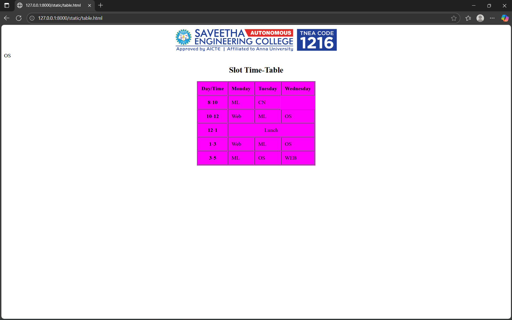

# Ex03 Time Table
## Date: 22-09-2025

## AIM
To write a html webpage page to display your slot timetable.

## ALGORITHM
### STEP 1
Create a Django-admin Interface.

### STEP 2
Create a static folder and inert HTML code.

### STEP 3
Create a simple table using ```<table>``` tag in html.

### STEP 4
Add header row using ```<th>``` tag.

### STEP 5
Add your timetable using ```<td>``` tag.

### STEP 6
Execute the program using runserver command.

## PROGRAM
```
<html>
    <head>

    </head>
    <body>
        <center>
            
        </center>
        <table border="1" cellpadding="10" align="center" bgcolor="magenta">
            <caption><h2>Slot Time-Table</h2></caption>
            <tr><th>Day/Time</th><th>Monday</th><th>Tuesday</th><th>Wednesday</th></tr>
            <tr><th>8-10</th>OS</td><td>ML</td><td>CN</td></tr>
            <tr><th>10-12</th><td>Web</td><td>ML</td><td>OS</td></tr>
            <tr align="center"><th>12-1</th><td colspan="3">Lunch</td></tr>
            <tr><th>1-3</th><td>Web</td><td>ML</td><td>OS</td></tr>
            <tr><th>3-5</th><td>ML</td><td>OS</td><td>WEB</td></tr>
        </table>
    </body>
</html>
```

## OUTPUT



## RESULT
The program for creating slot timetable using basic HTML tags is executed successfully.
